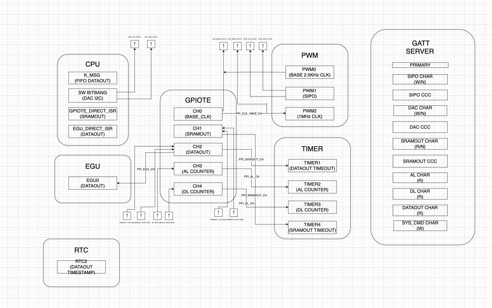

# Wireless Wearable Integrated Sparse-SPECT for Effective Radiotherapy Firmware (W-WISER)

Nordic Connect SDK Implementation on nRF52840 bluetooth SoC for Wireless Wearable Integrated Sparse-SPECT for Effective Radiotherapy. 

## Dependencies
* **nRF Connect SDK (v3.1.1)**
* **VS Code** with nRF Connect Extension Pack

## Patch Software Diagram

## Project Structure
* `demo/`: Demonstration of nRF52840 functionality.
* `integration_mb/`: The Motherboard firmware.
* `integration_asic/`: The Patch firmware.

## Documentation

Detailed toolchain installation and project overview can be found in the [official project documentation](https://docs.google.com/document/d/1Vihs7jUZQ4j5lskh_-5VBIR5FM5SCRFRUcvXVYvT9aw/edit?tab=t.0)
